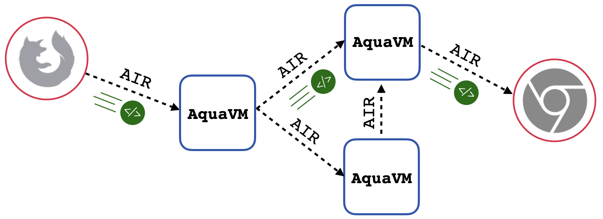
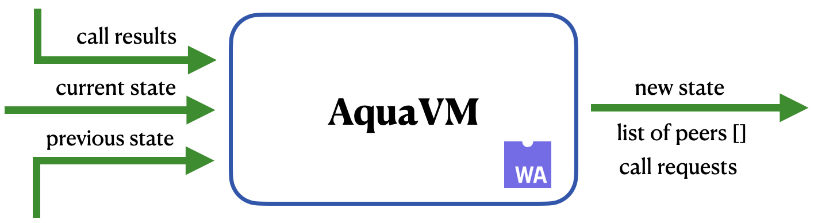

# AquaVM

AquaVM executes compiled [Aqua](https://github.com/fluencelabs/aqua), i.e., Aqua
Intermediate Representation (AIR) scripts, and plays an integral role in the
implementation of the [Fluence](https://fluence.network) peer-to-peer compute
protocol. Specifically, AquaVM allows expressing network choreography in scripts
and composing distributed, peer-to-peer hosted services. Moreover, AquaVM plays
a significant role in facilitating _function addressability_ in the Fluence
network, see Figure&nbsp;1.

**Figure 1: Stylized AquaVM And AIR Model**

Since AquaVM compiles to Wasm, it can run in both client, such as browsers and
Node.js apps, and server environments.

## AquaVM: Interpreter Execution Model

AquaVM's execution model facilitates Fluence protocol's data push model
implemented as a _particle_, i.e., a smart packet comprised of data, AIR, and
some metadata. In this context, AquaVM can be viewed as a pure state transition
function that facilitates particle updates, which includes state management of
particle data by taking previous and current state to produce a new state and an
updated list of peers and call requests in the remaining AIR workflow. In
addition to local service call execution, AquaVM handles requests from remote
peers, e.g., as a part of a parallel execution block, to call local services and
handle the future response, see Figure&nbsp;2.

**Figure 2: AquaVM Interpreter Execution Model**

In summary, the AquaVM execution model handles the topological hops for simple
and advanced composition patters, such as (async) parallel service execution on
one or multiple peers.

## Aquamarine Intermediate Representation (AIR): IR for P2P Systems

AIR is an [S-expression](https://www.s-expressions.org/home)-based low-level
language with binary form to come. It currently consists of fourteen
instructions with more instructions to come. Semantics of AIR is inspired by
[π-calculus](https://en.wikipedia.org/wiki/%CE%A0-calculus),
[λ-calculus](https://en.wikipedia.org/wiki/Lambda_calculus), and
[category theory](https://en.wikipedia.org/wiki/Category_theory). Its syntax is
inspired by
[Wasm Text Format](https://developer.mozilla.org/en-US/docs/WebAssembly/Understanding_the_text_format)
(WAT) and [Lisp](https://en.wikipedia.org/wiki/Lisp_(programming_language)). AIR
scripts control the Fluence peer-to-peer network, its peers and even resources
on other (p2p) networks, such as IPFS and Filecoin, e.g.,
[Fluence IPFS library](https://fluence.dev/docs/aqua-book/libraries/aqua-ipfs)
through Marine adapter services.

A description of AIR values and a list of AIR instructions together with
examples of their usage can be found [here](./docs/AIR.md). The main properties
of AIR and its interface are discussed [here](./air/README.md).

A complete list of AIR instructions with examples of their usage can be found
[here](./docs/AIR.md). The fundamental contracts of the AquaVM interface, along
with a more detailed interaction scheme can be found [here](./air/README.md).

## Repository Structure

- [**air**](./air) is the core of AquaVM
- [**air-interpreter**](./air-interpreter) is a crate to support different
  compilation targets (Marine and wasm-bindgen)
- [**avm**](./avm)
  - [client](./avm/client) is an AquaVM launcher for browser and Node.js targets
  - [server](./avm/server) is an AquaVM launcher for server-side targets
- [**crates**](./crates)
  - [air-lib](./crates/air-lib) contains all main crates for the core of AquaVM
  - [beautifier](./crates/beautifier) is an implementation of AIR-beautifier
  - [data-store](./crates/data-store) defines a `DataStore` trait used by the
    Fluence node
  - [interpreter-wasm](./crates/interpreter-wasm) is a crate for better
    integration of compiled Wasm code into the Fluence node
  - [testing-framework](./crates/testing-framework) is an implementation of the
    framework that improves test writing experience
- [**tools**](./tools) contains AquaVM-related tools

## Support

Please, file an [issue](https://github.com/fluencelabs/aquavm/issues) if you
find a bug. You can also contact us at
[Discord](https://discord.com/invite/5qSnPZKh7u) or
[Telegram](https://t.me/fluence_project). We will do our best to resolve the
issue ASAP.

## Contributing

Any interested person is welcome to contribute to the project. Please, make sure
you read and follow some basic [rules](./CONTRIBUTING.md).

## License

All software code is copyright (c) Fluence Labs, Inc. under the
[Apache-2.0](./LICENSE) license.
