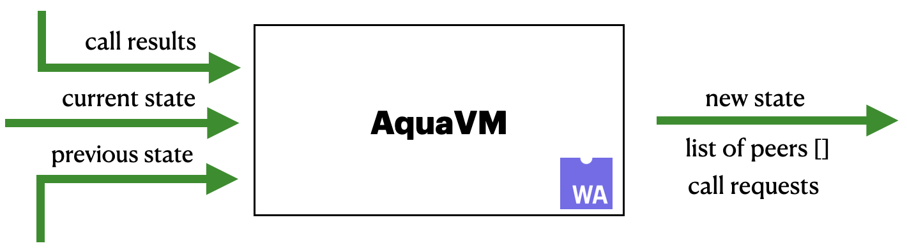

[](https://crates.io/crates/air-interpreter-wasm)
[](https://www.npmjs.com/package/@fluencelabs/avm)

# AquaVM

AquaVM is the interpreter of AIR scripts intended to be an integral pillar of the Fluence network. It allows expressing network choreography in scripts and compose distributed, peer-to-peer hosted services. AquaVM compiles to Wasm and run both client- and server-side.

## AquaVM: interpreter execution model

From a high level AquaVM could be considered as a pure state transition function that takes previous and current (usually came from a network) state and produces a new one with a list of peer where it should be sent. Additionally, the function returns requests to call services that should be called locally on a peer and then expects from a host to pass results back to it somewhere in the future.



This execution model aims to provide async/parallel service execution ability on a peer.

## Aquamarine Intermediate Representation (AIR)

### AIR: What is it?

- S-expression-based low-level language
- Controls Fluence network and its peers
- Consists of 12 instructions (more instructions to come)
- Semantic inspired by pi-calculus, lambda-calculus and theory of category
- Syntax inspired by WAT (Wasm Text Format) and Lisp

### AIR: Instructions
#### call

```wasm
(call "12D1Node" ("dht" "put") [key value] result)
```

- moves execution to a peer, specified by location (`"12D1Node"` in the example)
- peer is expected to have the specified Wasm service (`"dht"`)
- the `service` must have specified function (`"put"`) available to be called
- argument list (`[key value]`) will be given to the function
- result of the function execution is saved and available under output name (`result`)

#### seq

```wasm
(seq
    (call "12D1Node" ("dht" "get") [key] value)
    (call "12D1Storage" ("SQLite" "put") [key value] store_result)
)
```

- `seq` takes two instructions
- executes them sequentially: second instruction will be executed iff first one finished successfully

#### par

```wasm
(par
    (call "ClientA" ("chat" "display") [msg])
    (call "ClientB" ("chat" "display") [msg])
)
```

- `par` takes two instructions
- executes them in parallel: the second instruction will be executed independently of the completion of the first one

#### ap

```wasm
(seq
    (call "peer_id" ("user-list" "get_users") [] users)
    (ap users.$.[0].peer_id user_0)
)
```

- `ap` takes two values
- applies lambda to first and saves the result in second

#### match/mismath

```wasm
(seq
    (call "peer_id" ("user-list" "get_users") [] users)
    (mismatch users.$.length 0
        (ap users.$.[0].peer_id user_0)
    )
)
```

- `match`/`mismatch` takes two variables and an instruction
- executes the instruction iff variables are equal/notequal

#### fold

```wasm
(fold users user
    (seq
        (call user.$.peer_id ("chat" "display") [msg])
        (next user)
    )
)
```

- `fold` is a form of a fixed-point combinator
- takes an array or an iterable variable and an instruction
- iterates through the iterable (`users`), assigning each element to the iterator (`user`) 
- on each iteration instruction (`(seq ...)`) is executed
- instruction can read the iterator
- `next` triggers next iteration

#### xor

```wasm
(xor
    (call "ClientA" ("chat" "display") [msg])
    (call "ClientB" ("chat" "display") [msg])
)
```

- `xor` takes two instructions
- second one is executed iff the first one failed

#### null

```wasm
(null)
```

- `null` takes no arguments
- does nothing, useful for code generation

### AIR: values
#### Scalars

- scalars are fully consistent - have the same value on each peer during a script execution
- could be an argument of any instruction
- JSON-based (fold could iterate only over array-based value)

#### Streams

- streams are CRDT-like (locally-consistent) - have deterministic execution wrt one peer
- versioned
- could be used only by call and fold instructions (more instructions for streams to come)
- could be turned to scalar (canonicalized)
