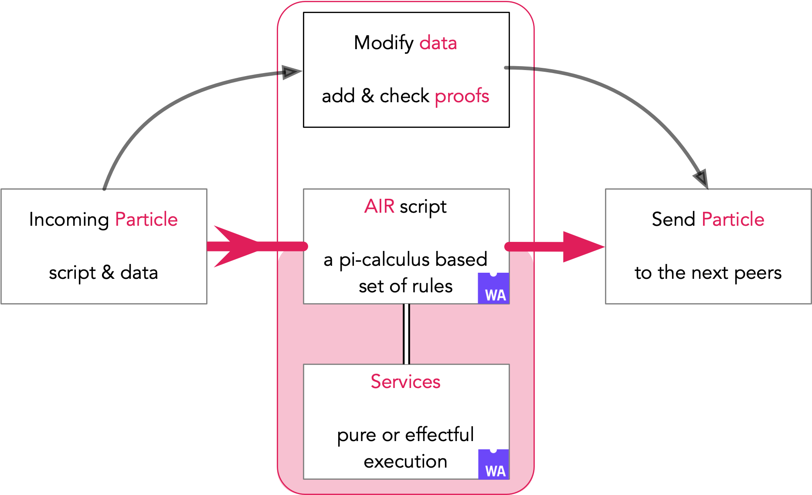
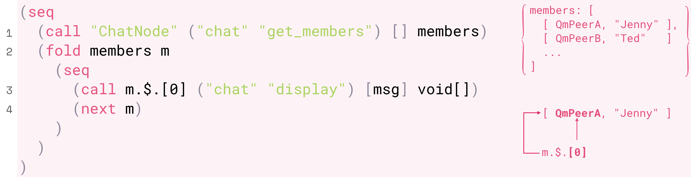
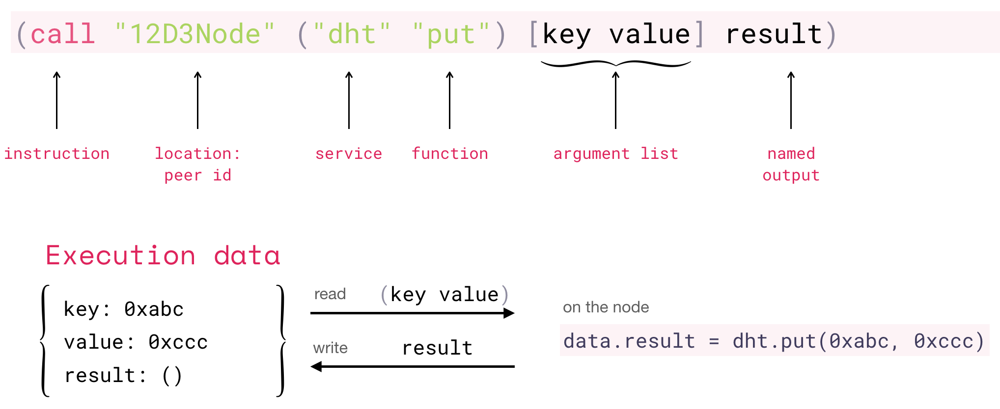
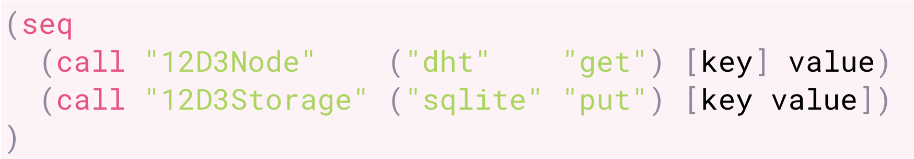
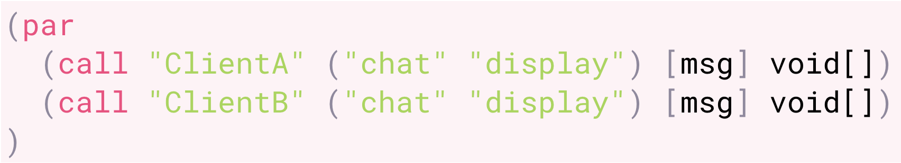
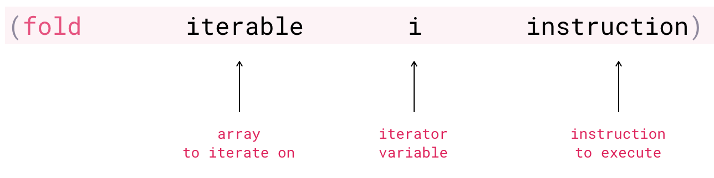
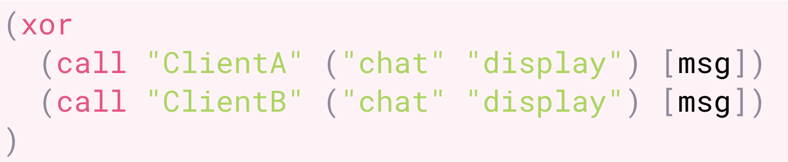
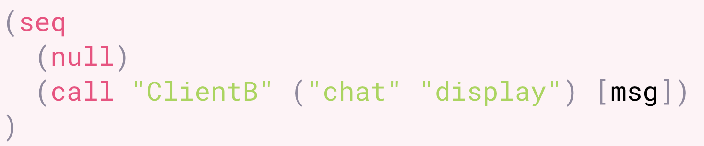

# Aquamarine

 - composability medium
 - allows developers to express network choreography in a script
 - moves script & data from peer to peer in a single-use logical network with checking merkle proofs and signatures.

 

    

 

## Fluence stack

Fluence [nodes](https://github.com/fluencelabs/fluence) uses AIR to coordinate requests between different services run by [Marine](https://github.com/fluencelabs/marine):

 

    

 

## Aquamarine Intermediate Representation

### AIR: What is it?

- S-expression-based low-level language
- Controls Fluence network and its peers
- Inspired by WAT (WebAssembly Text Format)
- Meant to be a compile target
- Development meant to happen in a higher-level language
- Syntax is in flux, will change

Scripts written in AIR look like this:

1. Gather chat members by calling chat.members
2. Iterate through elements in members array, m = element
3. Each m is an object, represented as array; [0] is the first field
4. `(next m)` triggers next iteration

### AIR: Instructions
#### call: execution

- `call` commands the execution
- moves execution to a peer, specified by `location`
- peer is expected to have specified WASM `service`
- the `service` must have specified `function` available to be called
- `argument list` is given to the `function`
- result of the `function` is saved and available under `output name`
- example call could be thought of as `data.result = dht.put(key, value)`

#### seq: sequential

- `seq` takes two instructions
- executes them sequentially

#### par: parallel

- `par` takes two instructions
- executes them in parallel

#### fold: iteration

- `fold` takes an array, a variable and an instruction
- iterates through the array, assigning each element to the variable
- on each iteration instruction is executed
- instruction can read the variable
- `next` triggers next iteration

#### xor: branching & error handling

- `xor` takes two instructions
- iff first instruction fails, second one is executed

#### null

- `null` takes no arguments
- does nothing, useful for code generation
