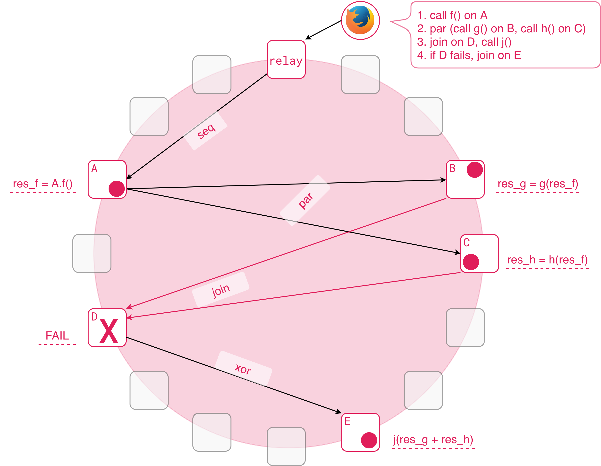

# Aquamarine

Aquamarine is a distributed choreography platform, controlled by AIR language

## AIR: Aquamarine Intermediate Representation
Scripts written in AIR look like this:

1. Gather chat members by calling chat.members
2. Iterate through elements in members array, m = element
3. Each m is an object, represented as array; [0] is the first field
4. (next m) triggers next iteration

### What is it?

- S-expression-based low-level language
- Controls Fluence network and its peers
- Inspired by WAT (WebAssembly Text Format)
- Meant to be a compile target
- Development meant to happen in a higher-level language
- Syntax is in flux, will change

### Instructions
#### call: execution

- `call` commands the execution
- takes network `location`, `service id`, `function name`, `list of function arguments`, and an `output name`
- moves execution to a peer, specified by `location`
- peer must have the specified WASM `service` running
- the `service` must have specified `function` available to be called
- `argument list` is given to the `function`
- result of the `function` is saved and available under `output name`
- example call could be thought of as `data.result = dht.put(key, value)`

#### seq: sequential

- `seq` takes two instructions
- executes them sequentially

#### par: parallel

- `par` takes two instructions
- executes them in parallel

#### fold: iteration

- `fold` takes an array, a variable and an instruction
- iterates through the array, assigning each element to the variable
- on each iteration instruction is executed
- instruction can read the variable
- `next` triggers next iteration

#### xor: branching & error handling

- `xor` takes two instructions
- iff first instruction fails, second one is executed

#### null

- `null` takes no arguments
- does nothing, useful for code generation

